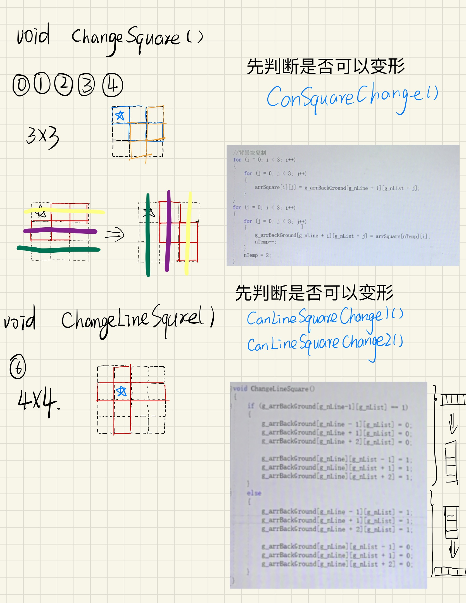

# 俄罗斯方块

* 属性
* 游戏规则
* 部分说明

****

## 属性

属性->配置属性->常规属性->平台工具集->Visual Studio 2019 (v142)  
****

## 游戏规则

* Enter键： 开始游戏
* 上键： 变形
* 下键： 加速下落
* 左键： 常规左移
* 右键： 常规右移
* 空格键： 暂停游戏，选择"取消"退出游戏，"重试"重开一局，"继续"继续本局游戏
* 点击“X”图标：可选择退出或继续游戏

****

## 部分说明

* 用二维数组表示游戏界面（g_arrBackGround[20][10]）和随机方块（g_arrSquare[2][4]）。  
游戏界面空白格子值为0；  
随机产生的还可以移动的方块每个格子值为1；  
不可以动的格子值为2；  
7种基本方块，如图。


* **【上键】变形**  
田字型方块变形前后无区别，不需要变形  
`void ChangeSquare();`  
前五种基本图形的变形方法  
`void ChangeLineSquare1();` 和 `void ChangeLineSquare2();`
横着的长条形和竖着的长条形的变形方法

`int CanSquareChange();`  
如果g_nList<0或者g_nList>7，那么 g_nList = 0 或者 g_nList = 7;  
如果3X3方格中没有值等于2，则可以变形；否则不可以变形。  
`int CanLineSquareChange1();`  
如果4X4方格中横竖两条长条夹着的方格（共12个）没有值等于2，则可以变形；否则不可以变形。  
`void ChangeLineSquare2();`  
①如果g_arrBackGround[g_nLine + 1][g_nList] == 1 && g_nList > 7)，不可变形；  
②如果g_arrBackGround[g_nLine][g_nList + 1] == 1 && g_nLine < 1，不可变形；  
③其他情况可以变形。

* **【左右键】左右移动**  
左移  
&emsp;&emsp;if ( CanSquareLeft1()==1 && CanSquareLeft2()==1 )  
&emsp;&emsp;&emsp;&emsp;从左到右遍历   
&emsp;&emsp;&emsp;&emsp;&emsp;把值为1的方格的左边一个方格的值变为1，  
&emsp;&emsp;&emsp;&emsp;&emsp;此方格值变为0  
&emsp;&emsp;&emsp;&emsp;  
`int CanSquareLeft1();`  
&emsp;&emsp;从上到下遍历第一列  
&emsp;&emsp;&emsp;&emsp;if (g_arrBackGround[i][0] == 1)  
&emsp;&emsp;&emsp;&emsp;&emsp;不能左移  
&emsp;&emsp;否则，可以左移  
`int CanSquareLeft2();`  
&emsp;&emsp;遍历整个游戏区域  
&emsp;&emsp;&emsp;&emsp;如果值为1的方格左边一个方格值为2  
&emsp;&emsp;&emsp;&emsp;&emsp;不能左移  
&emsp;&emsp;否则，可以左移

* **下落**  
下落，定时器响应函数 OnTimer 中的 SquareDown
CanSquareDown1()判断最后一行是否有值为1的方格，如果有，则不可下落；  
CanSquareDown2()判断所有值为1的方格下面的方格是否为2，如果有，则不可下落

```C
void OnTimer(HWND hWnd)
{
	//2*4方格的句柄
	HDC hDc = GetDC(hWnd);  //内核对象，人工释放


	if (CanSquareDown1() == 1&& CanSquareDown2()==1)
	{
		SquareDown();
		g_nLine++;
	}
	else
	{
		//1 to 2

		Change1To2();
		//OnPaint(hDc);
		DestoryFullLinesSquare();
		if (IsGameOver() == 1)
		{
			OnPaint(hDc);

			ReleaseDC(hWnd, hDc);
			// 首先关闭计时器，避免在计时器的驱动下再次调用本函数
			KillTimer(hWnd, DEF_TIMER1);
			// 然后通知玩家，Game Over了，退出进程。
			MessageBox(0, "Game Over", "Game Over", 0);
			ExitProcess(0);
		}
		CreateRandomSquare();
		CopySquareToBack();

	}
	
    ////显示方块
	//PaintSquare(hDc);
	OnPaint(hDc);

	ReleaseDC(hWnd, hDc);
}
```

* **【下键】加速下落**  
按下键调用OnTimer函数以达到加速下落的效果

* **是否游戏结束**  
`int Is GameOver();`  
&emsp;&emsp;遍历第一行   
&emsp;&emsp;&emsp;&emsp;如果  第一行存在值为2的方格  
&emsp;&emsp;&emsp;&emsp;&emsp;&emsp;游戏结束

* **消除满行**  
遍历每一行，值之和为20的就是满行  
消除满行就是把满行上面的所有行的值都往下移一行
```C
//消除所有满行
void DestoryFullLinesSquare()
{
	int i = 0;
	int j = 0;

	for (i = 19; i >= 0; i--)
	{
		int nSum = 0;
		for (j = 0; j < 10; j++)
		{
			nSum += g_arrBackGround[i][j];
		}
		if (nSum == 20)
		{
			DestoryOneLineSquare(i);//消除一行满行
			g_Score += 1;
			i++;
		}
	}
}

```

* **【空格】暂停**  
`OnSpace();`
```c
//游戏暂停
void GamePause(HWND hwnd)
{
	KillTimer(hwnd, DEF_TIMER1);
}
```  

①继续&emsp;SetTimer(hwnd, DEF_TIMER1, 300, NULL);  
②取消&emsp;DestroyWindow(hWnd);  
③重来&emsp;DesquareSquare();清空游戏界面  
&emsp;&emsp;&emsp;&emsp;g_Score = 0；  
&emsp;&emsp;&emsp;&emsp;SetTimer(hwnd, DEF_TIMER1, 300, NULL);  
&emsp;&emsp;&emsp;&emsp;OnCreate();  
